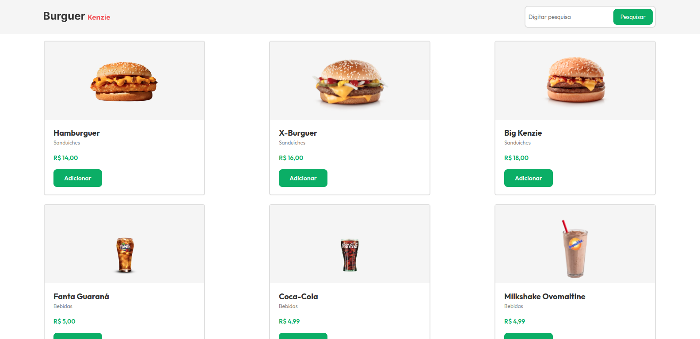

<h1 align="center"> E-commerce Kenzie Burguer </h1>

<p align="center">
Aplicação front-end que simula um e-commerce de fast-food
</p>

<p align="center">
  <a href="#-tecnologias">Tecnologias</a>&nbsp;&nbsp;&nbsp;|&nbsp;&nbsp;&nbsp;
  <a href="#-projeto">Projeto</a>&nbsp;&nbsp;&nbsp;|&nbsp;&nbsp;&nbsp;
  <a href="#-layout">Layout</a>&nbsp;&nbsp;&nbsp;|&nbsp;&nbsp;&nbsp;
  <a href="#memo-licença">Licença</a>
</p>

<p align="center">
  
</p>

<br>

<p align="center">
  
</p>

## 🚀 Tecnologias

Esse projeto foi desenvolvido com as seguintes tecnologias:

- HTML e CSS
- JavaScript ES6+
- [React.JS](https://reactjs.org/docs/getting-started.html)
- [styled-components](https://styled-components.com/docs)
- [create react-app (CRA)](https://create-react-app.dev/)

## 💻 Projeto

A Kenzie Burguer é o projeto que simula uma loja virtual estabelecido como atividade no curso de Desenvolvimento Full Stack da Kenzie Academy Brasil O objetivo desta entrega é construir uma aplicação baseada no que aprenderam em React até este momento, como também aperfeiçoar as habilidades de estilização.

## 🏡 Executando o projeto

Primeiro faça a instalação das dependências do projeto com o comando

```sh
yarn
```

Este é um projeto simples e se você o clonou em sua máquina para que possa ver ele em execução basta digitar o comando

```sh
yarn start
```

## 🔖 Layout

Você pode visualizar o layout do projeto [aqui](https://www.figma.com/file/DGYuUCq2pOjwHipdwYRTzq/Entrega%3A-e-Commerce-Kenzie-Burguer?node-id=0%3A1&t=4wyRrQcoxrp9SyWx-1). É necessário ter conta no [Figma](https://figma.com) para acessá-lo.

## 📝 Licença

Esse projeto está sob a licença MIT.

---
